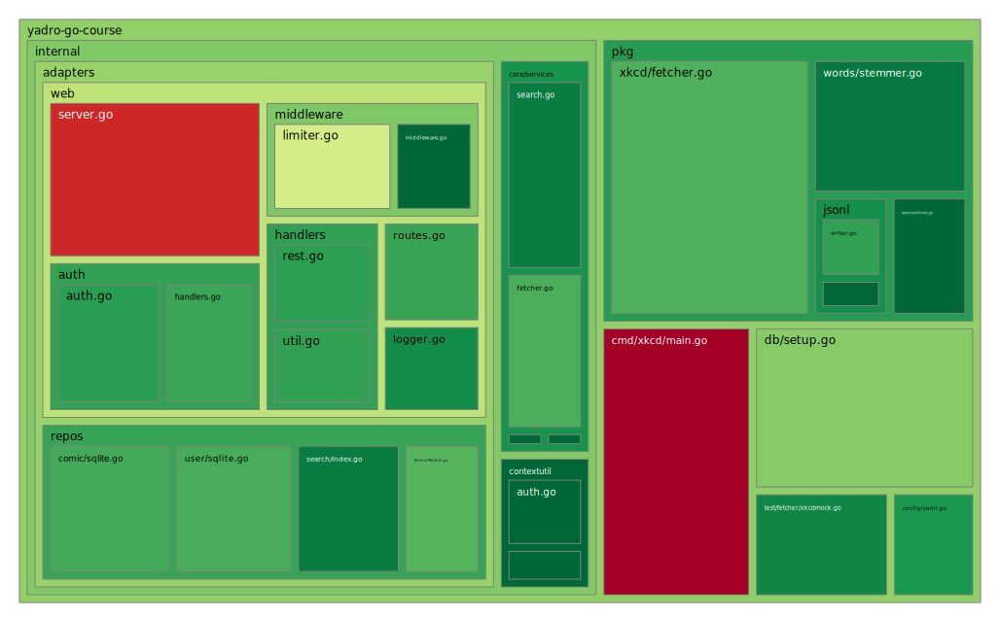
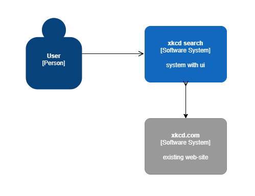
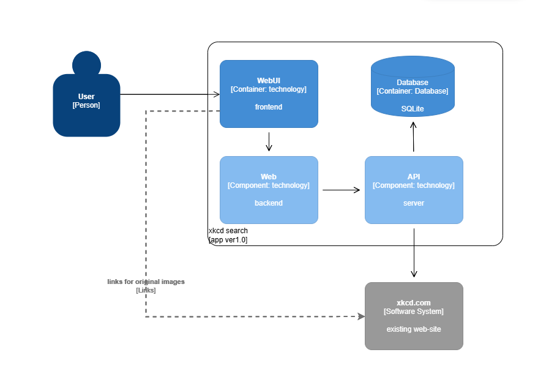

# xkcd-search

## Пользователи
Есть три пользователя:
* login: admin password: admin
* login: alice password: alice
* login: bob password: bob
## cURL
Получить токен
```
curl -X POST -v --data '{"login":"bob", "password":"bob"}' localhost:8080/api/login
```
Использовать токен
```
curl -v -H "Authorization: <token>" -X POST http://localhost:8080/api/update

```
## API
Все эндпоинты для работы с REST API имеют префикс /api

## Test Coverage


## Arch

### System Level


### Container Level


## Requirements

### Функциональные требования (FR):
1. Поиск комиксов по ключевым словам
   * FR1.1: Система должна предоставлять возможность поиска комиксов, по ключевым словам, в названии, описании и других метаданных.
   * FR1.2: Результаты поиска должны возвращаться в порядке релевантности.
3. Веб-интерфейс для поиска
   * FR2.1: Система должна предоставлять веб-интерфейс с полем ввода для поискового запроса.
   * FR2.2: Веб-интерфейс должен отображать результаты поиска в виде списка с возможностью пагинации.
4. REST API для поиска
   * FR3.1: Система должна предоставлять REST API эндпоинт (GET /api/pics?search={query}) для поиска комиксов.
   * FR3.2: Ответ API должен быть в формате JSON и содержать список комиксов с их метаданными.
5. Обновление поискового индекса
   * FR4.1: Система должна предоставлять API эндпоинт (POST /api/update) для ручного обновления поискового индекса.
   * FR4.2: Система должна поддерживать автоматическое обновление индекса по расписанию (раз в сутки).
6. Авторизация для защищённых ручек
   * FR5.1: Эндпоинт обновления индекса (POST /api/update) должен быть доступен только аутентифицированным пользователям с правами администратора.
   * FR5.2: Аутентификация должна выполняться через токен (JWT/Bearer Token) или API-ключ.

### Нефункциональные требования (NFR):
1. Производительность
   * NFR1.1: Поисковые запросы (веб и API) должны обрабатываться менее чем за 500 мс при средних нагрузках.
   * NFR1.2: Обновление индекса не должно занимать более 5 минут.
2. Масштабируемость
   * NFR2.1: Система должна выдерживать до 1000 RPS.
   * NFR2.2: Обновление индекса не должно блокировать поисковые запросы.
3. Надёжность
   * NFR3.1: Поисковый индекс должен автоматически восстанавливаться в случае сбоя.
